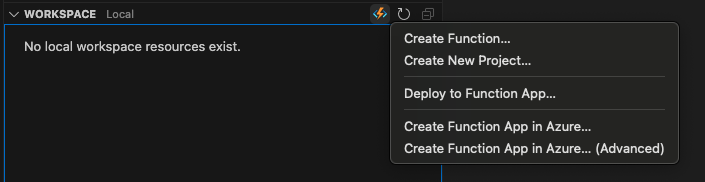
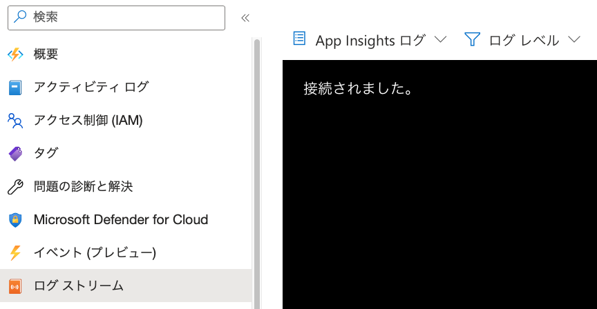
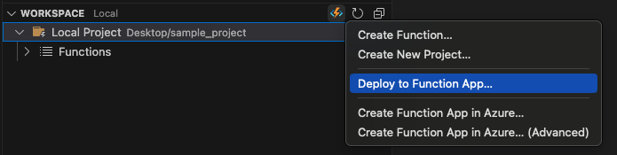

# Azure FunctionsをVisual Studio Codeで開発する (Python編)

[目次に戻る](./readme.md)

## Visual Studio Code (VSCode) のインストール

- 各OS用インストーラーをダウンロードしてインストールする方法
Visual Studio Codeのウェブサイト (https://code.visualstudio.com) からインストーラーをダウンロードし、実行する。

- (macOS) Homebrewを利用する方法

```zsh
% brew install visual-studio-code
```

## Visual Studio Code (VSCode) の拡張機能のインストール

VSCodeの画面左のブレードにある[拡張機能]アイコンをポイントし、以下の拡張機能をインストールする (https://learn.microsoft.com/ja-jp/power-pages/configure/vs-code-extension) 。

- Azure Account
- Azure Functions
- Python
- (option, 利用可能な場合) GitHub Copilot

## Azure Accountへの接続

VSCodeの画面左のブレードにある[Azure]アイコンをポイントし、Azureのアカウント情報を用いてサインインする。

## Azure Functionsプロジェクトの作成

VSCodeの画面左のブレードにある[Azure]アイコンをポイント、[WORKSPACE]の右に表示されるFunctionsアイコンをポイントする。


[Create New Project...]をポイントし、適当なディレクトリに"sample_project"ディレクトリを作成する。

[Select a language]で、"Python"を選択する。

[Select a Python programming model]で"Model V2 (Recommended)"を選択する。

[Select a Python interpreter to create a virtual environment]で、"Python3"を選択する。

[Select a template for your project's first function]で、"CosmosDB trigger"を選択する。

[作成する関数の名前]はデフォルト"cosmosdb_trigger"のまま[Enter]

[監視対象のコンテナーの名前]と[監視するコンテナーが含まれている、Cosmos DBデータベースの名前]に[Cosmos DB for NoSQLの操作](https://github.com/tahayaka-microsoft/CosmosDB_NoSQL_Essentials/blob/4ec8cce6d3c06d9fa62f2ce57b6d43f71ea01ccb/01_CreateAndOperationBasic_CosmosDB.md)で作成したコンテナーの名称（例：container1）、データベースの名称（例：db1）を入力する。

[Select the app setting with your Cosmos DB アカウント接続]で"+Create new local app setting"をポイントする。

[Select subscription]でサブスクリプションを選択し、[Select a database account]でCosmos DBアカウントを選択する。

Virtual envが作成され、コードサンプルが表示される。

```Python
import azure.functions as func
import logging

app = func.FunctionApp()

@app.cosmos_db_trigger(arg_name="azcosmosdb", container_name="container1",
                        database_name="db1", connection="rioholdevcsms_DOCUMENTDB")  
def cosmosdb_trigger(azcosmosdb: func.DocumentList):
    logging.info('Python CosmosDB triggered.')
```

## Azure Functionsの作成

Azure Portalを開き、マーケットプレースでAzure Functions "関数アプリ" を検索し、[作成]をクリックする。

以下のように設定する。

|項目|値|
|---|---|
|サブスクリプション|任意|
|リソースグループ|任意|
|関数アプリ名|任意(全世界で一意)|
|ランタイムスタック|Python|
|バージョン|3.11|
|地域|任意(JapanEast推奨)|
|オペレーティングシステム|Linux|
|ホスティングオプションとプラン|消費量(サーバーレス)|

デプロイが完了したらリソースに移動し、左のブレードから[ログストリーム]をポイントする。
"起動ログをキャプチャするための Application Insights の構成"画面の[構成]ボタンをクリックし、次の画面で[Application Insightsを有効にする]ボタンをクリックする。
さらに次の画面で[適用]ボタンをクリックする。
再度、Functionsの左のブレードから[ログストリーム]をポイントすると、App Insightログに接続される。


## プロジェクトをデプロイする

VSCodeの画面左のブレードにある[Azure]をポイントし、[WORKSPACE]の右に表示されるFunctionsのアイコンをポイントし、"Deploy to Function App..."をポイントする。


[Select subscription]でサブスクリプションを選択し、[Select resources]で前のステップで作成したAzure Functionsを選択する。

## Cosmos DBにテストデータを投入し、Functionsの動作を確認する

Functionsのログストリームとは別のブラウザのタグでAzure Portalを開き、Cosmos DBのデータエクスプローラを表示する。

Cosmos DBのデータエクスプローラーから下記のデータを新規に作成する(内容は任意に変更してもよい)
```JSON
{
  "id":"01234",
  "Description":"Sample Description"
}
```
